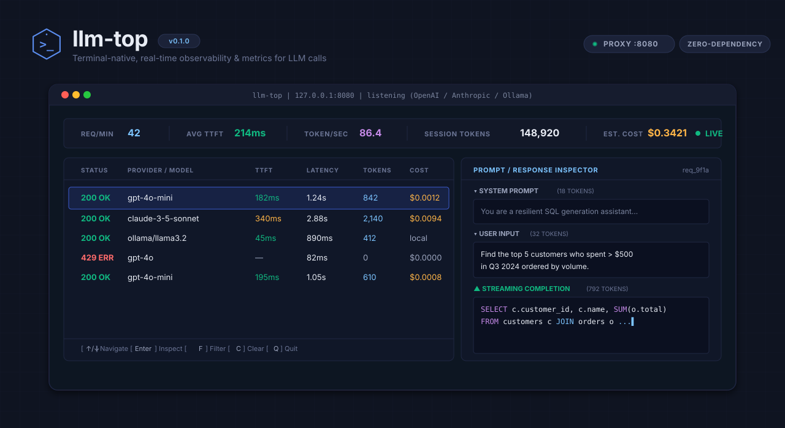

<p align="center">
  
</p>

<p align="center">
  <a href="https://github.com/aniketkarne-com/llm-top/releases/latest"></a>
  <a href="https://github.com/aniketkarne-com/llm-top/actions/workflows/tests.yml"></a>
  <a href="https://github.com/aniketkarne-com/llm-top/blob/main/LICENSE"></a>
  <a href="https://go.dev/"></a>
</p>

<p align="center">
  <b>The <code>htop</code> + <code>tcpdump</code> for local LLM development.</b><br>
  Point your code at <code>127.0.0.1:7777</code>. Replay, diff, compare, and benchmark every call — in one static Go binary.
</p>

<p align="center">
  
</p>

---

## What it is

**llm-top** is a single-binary OpenAI-compatible reverse proxy that turns your local LLM development loop into something you can actually inspect. You point your code at it, and it:

- **Captures every request and response** to an on-disk SQLite database (with secrets redacted before they touch disk)
- **Streams TTFT and per-token latency** through a live terminal dashboard
- **Detects anomalies** in real time — TTFT spikes, latency spikes, token explosions, error bursts, repeated prompts, provider degradation
- **Exposes Prometheus metrics** at `/metrics` so you can graduate to Grafana without changing your workflow
- **Replays, curls, edits, diffs, and compares** any captured request — same model, different model, different provider, different machine
- **Sessions** let you group captured requests ("baseline run", "candidate run") and diff them

Zero infrastructure. No SaaS account. No "paste your API key, wait for indexing." Just a binary that you can build, run, and grep.

---

## 30-second start

```bash
# 1. Install
go install github.com/aniketkarne-com/llm-top/cmd/llm-top@latest

# 2. Try the zero-deps demo (no API key, no network, ~2s)
llm-top demo

# 3. Point your code at it
export OPENAI_BASE_URL=http://127.0.0.1:7777/v1
export OPENAI_API_KEY=sk-...
llm-top --sqlite sessions.db
# (terminal dashboard opens, requests stream in live)

# 4. After your run, replay any single call
llm-top show 5f7a3c81ec7e0b22 --sqlite sessions.db
llm-top replay 5f7a3c81ec7e0b22 --sqlite sessions.db
```

That's the whole story. The rest of this README is about what you can do once you're capturing requests.

---

## What you can do with it

### 1. Live dashboard

```text
╔══════════════════════════════════════════════════════════════════════════╗
║ ⚠ 4 anomalies                                                            ║
║ llm-top • listen=127.0.0.1:7777 upstream=api.openai.com                  ║
║ j/k nav • Enter expand • a/s/? • Ctrl-C quit                            ║
╠══════════════════════════════════════════════════════════════════════════╣
── metrics ──
 requests      : 47
 errors        : 1
 avg TTFT      : 188ms
 avg total     : 2.1s
 p50 total     : 1.8s
 p95 total     : 4.2s
 prompt tokens : 12,400
 output tokens : 8,900
── recent activity ──
 ▶   [14:32:01] request   gpt-5.5-mini  | {"messages":[{"role":"user"...}]}
     [14:32:01] response  gpt-5.5-mini  | Sure! The capital of France...
 ▼   [14:32:03] request   claude-sonnet-5 | {"messages":[{"role":"user"...}]}
     [14:32:05] response  claude-sonnet-5 | Paris is the capital of...
── detail ──
 prompt:    {"messages":[{"role":"user","content":"hi"}]}
 response:  Paris is the capital of France.
╚══════════════════════════════════════════════════════════════════════════╝
```

Press `Enter` to expand any row inline. Press `a` to see recent anomalies, `s` to pick a session, `?` for help. Press `d` or `r` to get a hint for the equivalent CLI command, then drop into a shell and run it.

### 2. Side-by-side model comparison

You have one captured request. You want to know what GPT-5.5, Claude Sonnet 5, and your local Ollama would each do with it.

```bash
$ llm-top compare 5f7a3c81ec7e0b22 \
    --target "gpt-5.5=https://api.openai.com/v1|sk-..." \
    --target "claude=https://api.anthropic.com/v1|sk-ant-..." \
    --target "local=http://localhost:11434/v1"

compare: captured=5f7a3c81ec7e0b22

            fast        medium      slow
          ────────────────────────────────────
status      200           200           200
model       gpt-5.5-mini  gpt-5.5-mini  gpt-5.5-mini
provider    local         local         local
ttft        -             -             -
total       23ms          102ms         302ms
input       2             2             2
output      1             1             1
cost        $0.00         $0.00         $0.00

excerpts:
  fast: {"choices":...,"content":"fast",...}
  medium: {"choices":...,"content":"medium",...}
  slow: {"choices":...,"content":"slow",...}
```

Requests fire in parallel; partial failure is rendered cleanly (`ERR` in the status cell, the error in an `errors:` section below).

### 3. Replay with model override

```bash
# The captured request used gpt-5.5-mini. Try it against claude-sonnet-5.
$ llm-top replay 5f7a3c81ec7e0b22 --model claude-sonnet-5 \
    --upstream https://api.anthropic.com --api-key sk-ant-...

replayed id=a8c70ba0 status=200 model=claude-sonnet-5 target=https://api.anthropic.com ttft=- total=1ms in=2 out=3 cost=$0.0000 stream=false
```

Use `--local` to redirect to an Ollama instance. Use `--no-stream` to force non-streaming. The captured body is rewritten in place via surgical field replacement — no remarshal, the rest of your prompt is byte-identical.

### 4. Edit-and-replay

```bash
$ llm-top edit 5f7a3c81ec7e0b22
# opens $EDITOR (vi, nano, or your $VISUAL) with the captured request body
# save and quit
replayed id=e0b837f8 status=200 model=gpt-5.5 target=api.openai.com ...
```

If your edit produces invalid JSON, llm-top exits 2 without firing the request — no surprises in CI.

### 5. Render as curl, copy into another tool

```bash
$ llm-top curl 5f7a3c81ec7e0b22 --upstream http://127.0.0.1:11434/v1
curl -sS -X POST 'http://127.0.0.1:11434/v1/chat/completions' \
  -H 'Authorization: Bearer ***' \
  -H 'Content-Type: application/json' \
  -d '{"model":"gpt-5.5-mini","messages":[{"role":"user","content":"hi"}]}'
```

By default the API key is masked as `***` so you can paste into chat / Slack / commits safely. Use `--reveal-key` to inject a real key.

### 6. Sessions: baseline vs candidate

```bash
# Start a baseline session, run your agent, stop the session.
$ llm-top session start --name "v1-baseline" --label perf
session started: id=a32267888dfaeccf ...

# ... run your agent ...

$ llm-top session stop --id a32267888dfaeccf
session stopped: id=a32267888dfaeccf ended=...

# Run the candidate. Start another session.
$ llm-top session start --name "v2-candidate" --label perf

# ... run with the new prompt / model / etc ...

$ llm-top session stop

# Diff them.
$ llm-top session diff v1-baseline v2-candidate
Session perf/v1-baseline vs perf/v2-candidate

requests:      3 → 2
avg TTFT:      -   → 190ms
p95 latency:   0.12s → 0.27s
input tokens:  24.0k → 18.0k
output tokens: 2.1k → 1.7k
cost/request:  $0.080 → 0.050
total cost:    $0.240 → 0.100
errors:        0 → 0
```

The diff is exactly the format the original `htop + tcpdump` spec sketched.

### 7. Anomaly detection

Every captured request is checked against a rolling baseline per model. When something drifts, it's flagged and persisted.

```bash
$ llm-top anomalies --since 1h
⚠ 2 anomalies
─────────────────────────────────────
WARN   latency_spike      total 5,002ms on gpt-5.5-mini (baseline 53ms, x94.4)
WARN   error_burst        60% errors on claude-sonnet-5/anthropic in last 20 requests (12/20)
```

Detectors (all configurable via flags):

| Detector | Trigger |
|---|---|
| `ttft_spike` | Streaming TTFT > 3× rolling p95 per model |
| `latency_spike` | Total latency > 3× rolling p95 per model |
| `token_explosion` | Output tokens > 3× rolling mean per model |
| `repeated_prompt` | Same prompt hash fired N times in 60s |
| `error_burst` | >25% errors in last 20 requests |
| `large_context` | Input tokens > 32k absolute |
| `provider_degrade` | One provider's error rate >> others for the same model |

### 8. Prometheus / Grafana

```bash
$ curl -s http://127.0.0.1:7777/metrics | grep ^llm_
llm_requests_total{model="gpt-5.5-mini",provider="openai",status="all"} 47
llm_errors_total{model="gpt-5.5-mini",provider="openai",kind="5xx"} 2
llm_input_tokens_total{model="gpt-5.5-mini",provider="openai"} 12400
llm_output_tokens_total{model="gpt-5.5-mini",provider="openai"} 8900
llm_latency_seconds_bucket{model="gpt-5.5-mini",provider="openai",le="0.1"} 12
llm_latency_seconds_bucket{model="gpt-5.5-mini",provider="openai",le="1"} 41
llm_latency_seconds_bucket{model="gpt-5.5-mini",provider="openai",le="+Inf"} 47
llm_latency_seconds_count{model="gpt-5.5-mini",provider="openai"} 47
llm_latency_seconds_sum{model="gpt-5.5-mini",provider="openai"} 99.412
llm_anomalies_total{kind="latency_spike",severity="warn"} 3
llm_anomalies_total{kind="error_burst",severity="alert"} 1
```

A `docker-compose.yml` with Prometheus + Grafana + a starter 6-panel dashboard is in [`examples/`](examples/). Bring up the stack with `docker compose -f examples/docker-compose.yml up` and point your browser at `http://localhost:3000` — login `admin/admin`, the `llm-top overview` dashboard auto-loads.

---

## Install & run

### One-shot install

```bash
go install github.com/aniketkarne-com/llm-top/cmd/llm-top@latest
```

### From source

```bash
git clone https://github.com/aniketkarne-com/llm-top
cd llm-top
go build -o bin/llm-top ./cmd/llm-top
# SQLite persistence (recommended):
go build -tags sqlite -o bin/llm-top-sqlite ./cmd/llm-top
```

The `-tags sqlite` build is what you want for anything beyond the demo. It pulls in `modernc.org/sqlite` (a pure-Go SQLite driver, no CGO) and unlocks `requests`, `show`, `replay`, `curl`, `edit`, `diff`, `compare`, `session`, and `anomalies` subcommands.

### Point your code at it

```bash
# Anything that talks OpenAI / vLLM / Ollama (which all use the same wire format)
export OPENAI_BASE_URL=http://127.0.0.1:7777/v1
export OPENAI_API_KEY=sk-...   # whatever your upstream expects

llm-top --sqlite sessions.db --api-key sk-...
```

That's it. The proxy listens on `127.0.0.1:7777`, the dashboard runs in your terminal, and every call is captured.

### Flags

| Flag | Default | Notes |
|---|---|---|
| `--listen` | `127.0.0.1:7777` | bind address |
| `--upstream` | `https://api.openai.com` | real LLM provider |
| `--api-key` | `$OPENAI_API_KEY` | bearer token sent upstream |
| `--sqlite` | (none) | path to persistence DB; required for all subcommands |
| `--session` | (none) | session id to attach captured requests to |
| `--mode` | `integrated` | `proxy` / `ui` / `integrated` |
| `--buffer` | 500 | in-memory ring size for the dashboard |
| `--ui` | true | set false for headless proxy mode |

Environment variables: `LLMTOP_LISTEN`, `LLMTOP_UPSTREAM`, `LLMTOP_API_KEY`, `LLMTOP_SQLITE`, `LLMTOP_SESSION`, `LLMTOP_MODE`, `LLMTOP_BUFFER`, `LLMTOP_UI`.

---

## All subcommands

| Subcommand | What it does |
|---|---|
| `llm-top demo` | Zero-deps zero-network showcase (~2s, ~5 fake requests) |
| `llm-top requests` | List captured requests (table or JSON) |
| `llm-top show <id>` | Full detail for one request (pretty JSON, secrets redacted) |
| `llm-top replay <id>` | Re-fire a captured request; `--model`, `--upstream`, `--api-key`, `--local`, `--no-stream`, `--timeout`, `--headers` |
| `llm-top curl <id>` | Render a paste-able curl; `--reveal-key`, `--upstream`, `--api-key`, `--headers` |
| `llm-top edit <id>` | Open captured body in `$EDITOR`, replay on save; `--upstream`, `--api-key`, `--local`, `--timeout` |
| `llm-top diff <a> <b>` | Unified body diff OR side-by-side metric diff (`--metrics`) |
| `llm-top compare <id>` | Re-fire to N targets in parallel; `--target`, `--model`, `--local`, `--timeout`, `--concurrency`, `--format text\|json` |
| `llm-top session start\|list\|show\|diff\|stop` | Group captured requests into sessions, diff them |
| `llm-top anomalies` | List detected anomalies (`--since`, `--kind`, `--limit`, `--json`) |

All subcommands that read the DB accept `--sqlite PATH` (default: `$LLMTOP_SQLITE` or `./llm-top.db`).

---

## What llm-top is **not**

- **Not a SaaS.** Your requests and API keys never leave your machine. The redactor runs before anything touches disk.
- **Not a replacement for Langfuse, Helicone, Arize Phoenix, Datadog, or any hosted observability backend.** llm-top is the local-first tool you run while developing. When you're ready to ship to prod and want trace aggregation across many users / many regions / many model versions, use one of those.
- **Not an eval framework.** It doesn't grade output quality. It catches *performance* anomalies and lets you diff captured requests side-by-side. For "is the answer better?" use a dedicated eval tool.
- **Not an agent loop breaker.** If you want a runtime circuit-breaker for agent tool-call loops, see [agent-fuse](https://github.com/aniketkarne-com/agent-fuse).
- **Not a cost-control tool for production fleets.** Single-machine, single-user. The cost totals assume the upstream's published price; no caching, no rate limiting, no batched billing.

In one line: **llm-top is `htop + tcpdump` for LLM development on your laptop.** That's it.

---

## Architecture

```text
  ┌────────────┐    HTTP     ┌───────────────────────┐     HTTP/SSE    ┌──────────────┐
  │  client    │  ────────►  │  llm-top  (Go)        │  ────────────►  │  upstream    │
  │ (your app) │  ◄────────  │                       │  ◄────────────  │  (OpenAI,    │
  │            │   SSE/JSON  │  reverse proxy        │   SSE/JSON     │   vLLM, ...) │
  └────────────┘             │  + SSE parser         │                └──────────────┘
                             │  + metrics + redactor │
                             │  + anomaly detector   │   ┌──────────────────────────┐
                             │  + ring buffer (500)  │   │   terminal UI (bubbletea) │
                             │  + SQLite persistence │   │   j/k nav • Enter expand  │
                             │           │           │   │   a/s/? overlays          │
                             │           ▼           │   └──────────────────────────┘
                             │  ┌─────────────────┐  │
                             │  │  requests table  │  │──── GET /metrics ────────────► Prometheus
                             │  │  + sessions      │  │
                             │  │  + anomalies     │  │
                             │  └─────────────────┘  │
                             └───────────────────────┘
```

- **Reverse proxy** with OpenAI-compatible wire format — drop-in for any HTTP client that supports `OPENAI_BASE_URL`
- **SSE parser** that measures time-to-first-token and accumulates streamed content for the inspector
- **In-memory ring buffer** (default 500 entries) for the dashboard's activity pane — bounded so a runaway agent doesn't OOM your laptop
- **Optional SQLite store** for everything else: requests, sessions, anomalies, all persisted with `INSERT OR IGNORE` so retries are idempotent
- **Rolling-baseline anomaly detector** in memory; anomalies are fanned out to both SQLite and a buffered channel that feeds the Prometheus counter
- **Stdlib-only Prometheus exporter** at `/metrics` — no `github.com/prometheus/client_golang` dependency
- **Bubbletea TUI** with keymap: `j/k` row nav, `Enter` expand, `d`/`r` hint at external CLI, `a` anomalies overlay, `s` session picker, `?` help, `Esc` collapse, `Ctrl-C` quit

---

## Security

- API keys are redacted from request bodies before they touch the ring buffer or the SQLite store. The redactor runs on the inbound body; outbound headers (which contain `Authorization: Bearer ...`) are never written to disk.
- The redactor's defaults cover OpenAI/Anthropic-style keys (`sk-…`, `sk-ant-…`, JWTs), bearer tokens, and generic `api_key`/`token` JSON fields. You can extend it; the regex patterns live in [`internal/redactor/`](internal/redactor/).
- The SQLite store is plaintext. Treat the DB file like a credential: don't commit it, don't share it.
- `/metrics` is served on the same port as the proxy. Bind to `127.0.0.1` (the default) when developing locally. Don't expose to a public network without putting a real reverse proxy in front.

---

## Development

```bash
git clone https://github.com/aniketkarne-com/llm-top
cd llm-top
go test ./...
go test -tags sqlite ./...
make build      # writes bin/llm-top and bin/llm-top-sqlite
```

Layout:

```text
cmd/llm-top/        main binary
internal/anomaly/   rolling-baseline detector + persistent anomaly log
internal/compare/    side-by-side target comparison
internal/config/     CLI flag / env / JSON loader
internal/demo/       zero-deps zero-network showcase
internal/metrics/    in-memory recorder
internal/pricing/    cost tables
internal/prom/       stdlib-only Prometheus text-format exporter
internal/proxy/      OpenAI-compatible reverse proxy with SSE interception
internal/redactor/   secret scrubber
internal/replay/     replay / curl / edit
internal/session/    capture sessions + diff
internal/store/      SQLite persistence (build-tag gated)
internal/ui/         bubbletea TUI + anomaly banner + overlays
examples/            Prometheus scrape + Grafana dashboard + docker-compose
```

---

## License

MIT — see [LICENSE](LICENSE).
